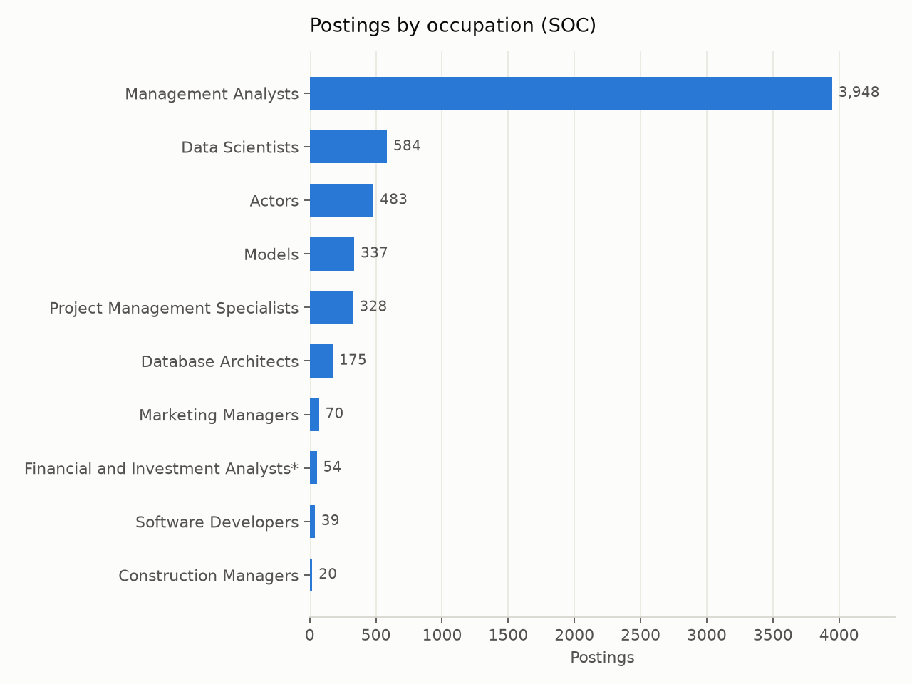
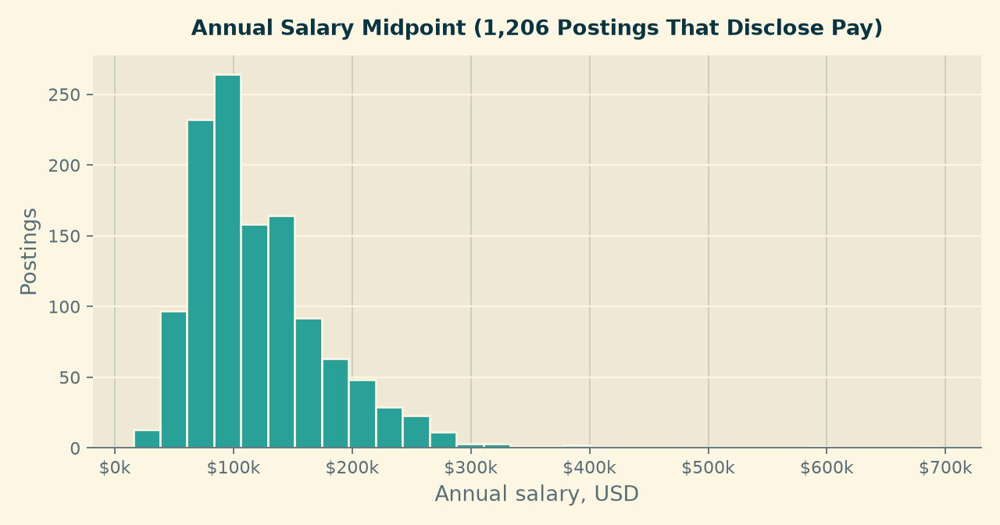
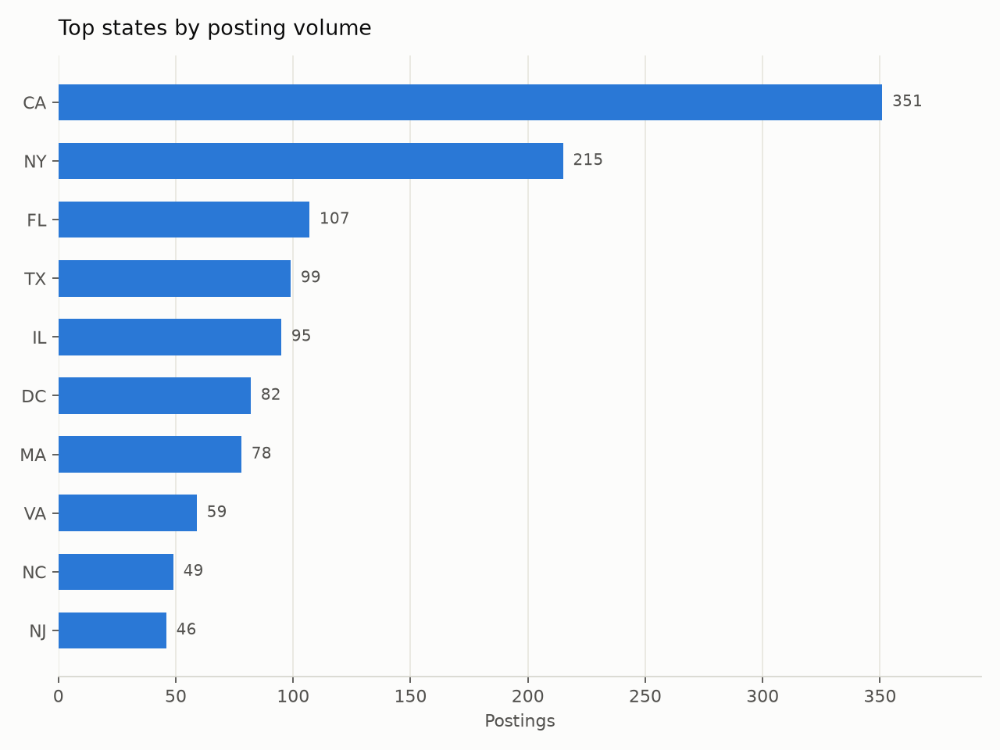
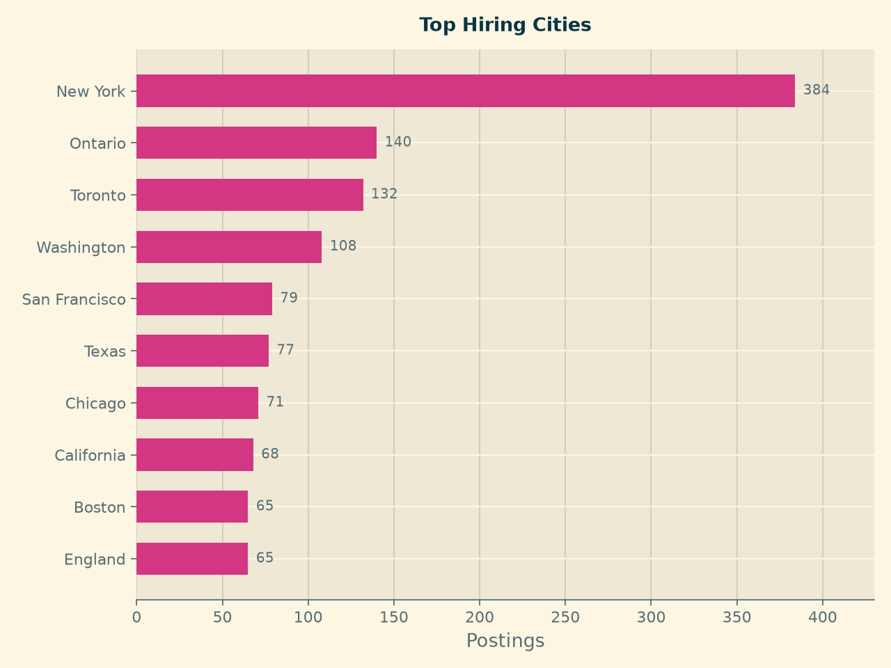
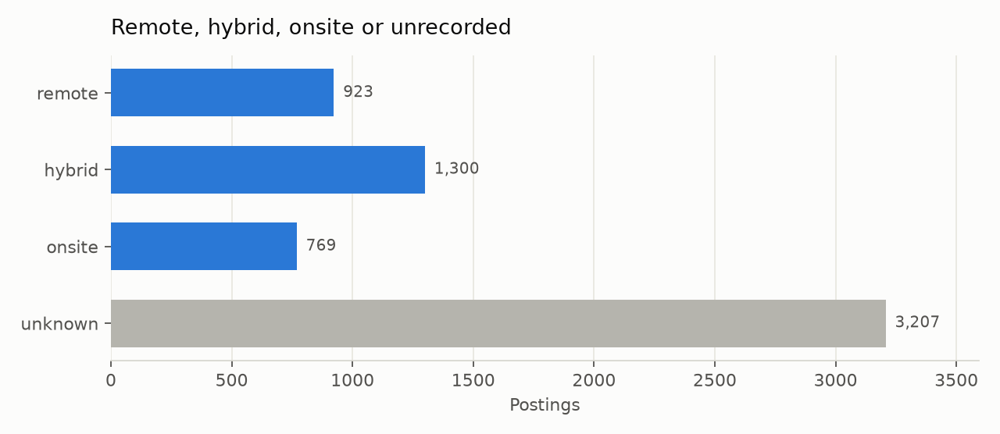
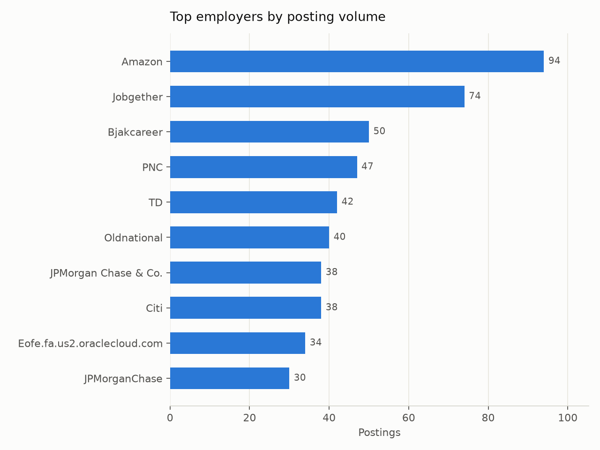

## What This Page Shows

This is the current state of the market our product advises on: **6,199 postings** for Business Intelligence and Data Analyst roles in NAICS 523, Securities, Commodity Contracts and Other Financial Investments, published within the twelve months to September 2026.

Every figure below is drawn from `data/processed/career_market_panel.csv`. How that table was built, and where its gaps are, is documented on the [Data Preparation](data_cleaning.qmd) page. Coverage varies by field, so each chart states how many postings it is based on.

## Which Occupations Dominate

**Management Analysts account for 3,948 postings, 64 percent of the panel.** That single occupational code dwarfs everything else: Data Scientists come second with 584. For a job seeker this is the most immediately actionable finding on the page — in this industry, analytics work is largely filed under a title family that does not contain the words "data" or "analytics" at all. A search that looks only for "Data Analyst" will miss most of the market.

The third entry, Actors with 483 postings, is not a real analytics occupation. It is occupational-coding noise in the source data: postings whose SOC label is simply wrong. We report it rather than quietly deleting it, because it is direct evidence for why our role filter combines occupational codes with title keywords instead of trusting either alone.

## How Titles Are Written

**There are 4,841 distinct job titles across 6,199 postings**, and the most common one — "financial analyst" — appears just 55 times, under one percent of the panel. Titles in this industry are effectively unique strings.

The practical consequence for a candidate is that title-based job alerts are close to useless here. Searching by skills and occupational family returns far more of the real market than searching by job title.

## What The Work Pays

Among the **1,206 postings (19 percent) that disclose pay**, the median midpoint is **\$105,750**, with the middle half falling between \$80,000 and \$147,090.

Two cautions belong with that number. First, four postings in five say nothing about pay, and employers who publish salary ranges are not a random sample — pay-transparency laws apply in some states and not others, so the disclosed group skews toward those jurisdictions and toward larger employers. Second, the figure is a midpoint of a posted range, not an offer. Read it as an orientation for expectations, not a benchmark to negotiate against.

## Where The Jobs Are

Of the **1,761 postings carrying a US state code**, California leads with 351, followed by New York (215), Florida (107), Texas (99) and Illinois (95).

At city level New York is the clear centre with 384 postings. Note that Ontario (140) and Toronto (132) appear high in this list: the dataset is not restricted to the United States, and a meaningful share of postings are Canadian. Anyone reading the geography of this market should treat the city chart as North American rather than US-only.

Because only 28 percent of postings identify a state, these counts describe the labelled subset. They are reliable for ranking the major hubs against each other and unreliable as absolute measures of how many jobs exist in each place.

## How Much Experience Is Asked For

Across the **4,093 postings where an experience requirement could be read from the description**, the median is **five years**, and the distribution is strikingly top-heavy: 908 postings ask for five to six years, 737 ask for ten or more, and only **61 postings ask for less than one year**.

This is the least comfortable and most useful finding on the page. Securities and investments is not an entry-heavy market for analysts. A student targeting it directly out of a programme is competing for a small share of openings, and the realistic paths are either the small entry band, adjacent industries with more junior demand, or roles where prior domain exposure substitutes for years served. Module 3 will test which skills most effectively close that distance.

## Remote, Hybrid Or Onsite

Remote status is recorded on **2,992 postings, 48 percent of the panel**. Among those, **hybrid leads at 43 percent, remote at 31 percent and onsite at 26 percent**.

This contradicts the expectation we set out in the [Introduction](introduction.qmd), where we predicted that remote openings in finance would be rarer than in the software sector. On the labelled half of this panel, roughly three in four analytics postings offer some flexibility. We report the contradiction rather than adjust the hypothesis after the fact.

The caveat is the unlabelled half. "Unknown" is shown as its own bar and never folded into "onsite", because an unlabelled posting is an absence of information, not evidence of an office requirement.

## Who Is Hiring

The employer side is **highly fragmented: 3,404 distinct employers across 6,199 postings**. The largest single employer, Amazon, accounts for 94 postings — 1.5 percent of the panel — and the top ten employers together account for only 8 percent.

The strategic read is that there is no short list of firms to focus a search on. Unlike a market dominated by a handful of large employers, breadth matters more than targeting here. The presence of Amazon at the top is also a reminder that industry assignment in this dataset follows the employer record rather than the specific business unit, so some postings sit in NAICS 523 for reasons that are not obvious from the company name.

## What This Means For The Product

Five things a candidate should take from this baseline:

1. **Search by occupation and skills, not by title.** Two-thirds of the market is coded as Management Analyst, and titles are nearly unique strings.
2. **Expect a mid-career market.** The median posting asks for five years; fewer than one in sixty asks for less than one.
3. **Flexibility is available.** Three-quarters of labelled postings are remote or hybrid, which widens the geographic options considerably.
4. **Cast a wide net across employers.** No firm holds more than two percent of postings.
5. **Treat salary figures as orientation.** They come from the one posting in five that discloses pay.

Module 3 turns these observations into a personal assessment: which skills separate the postings a given candidate can win from the ones they cannot, and what to learn first.
