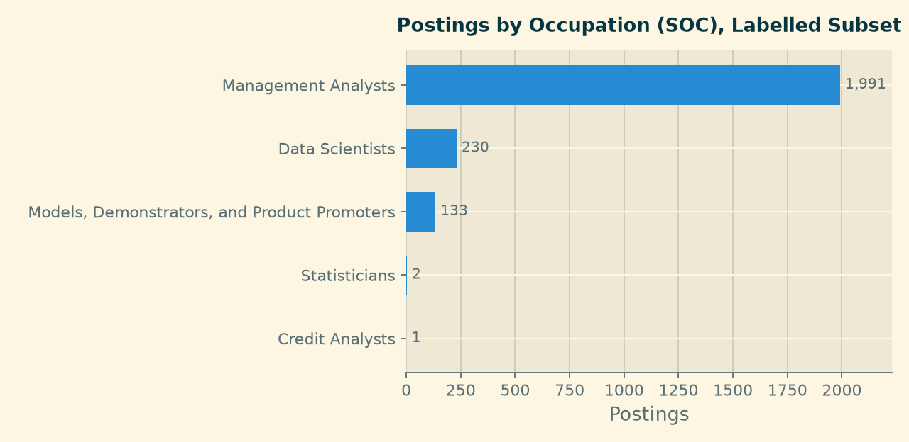
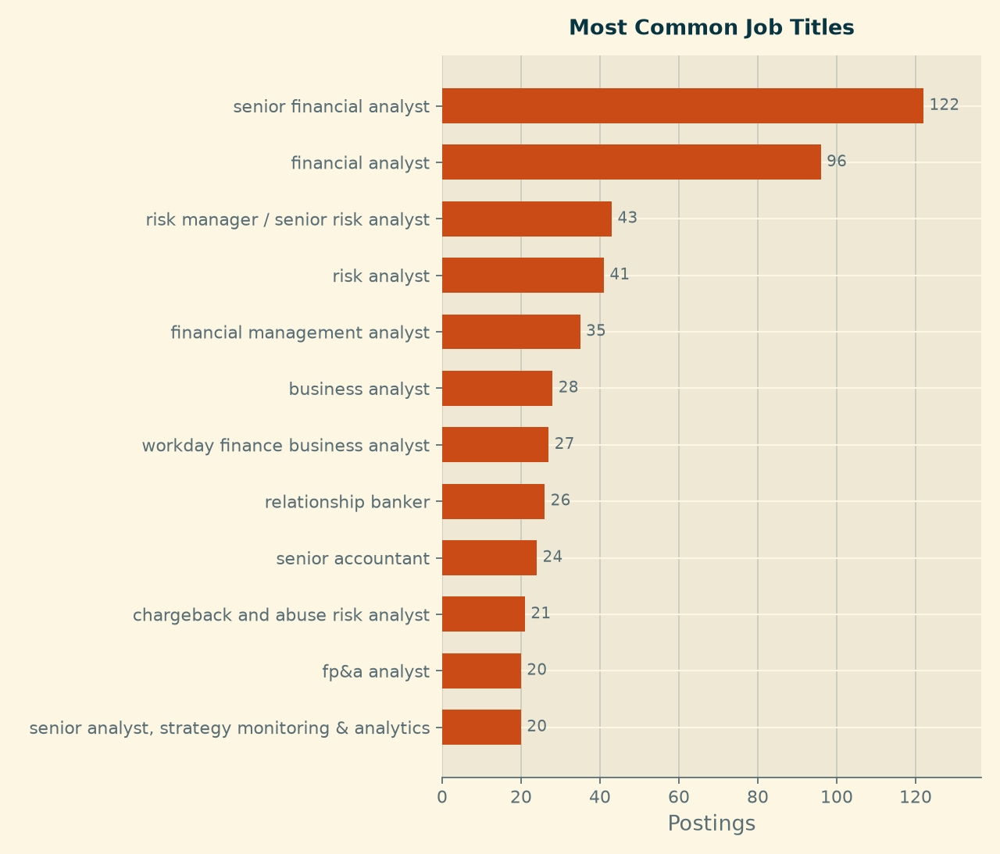
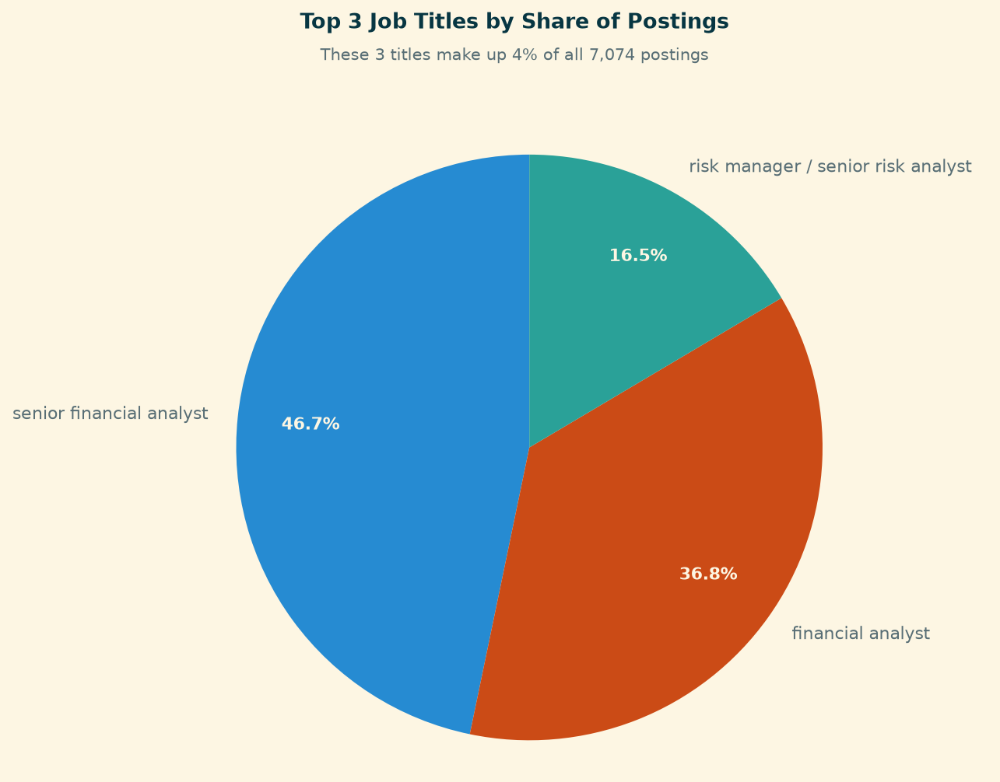
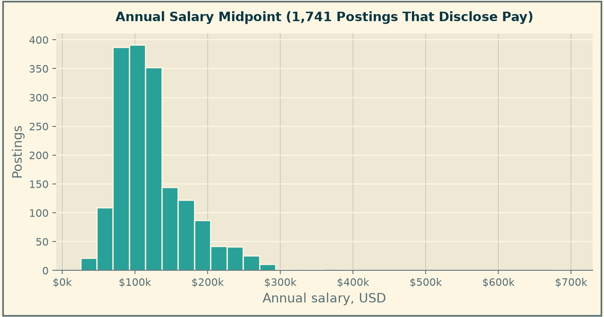
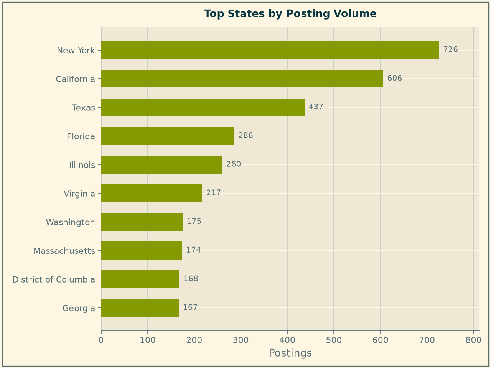
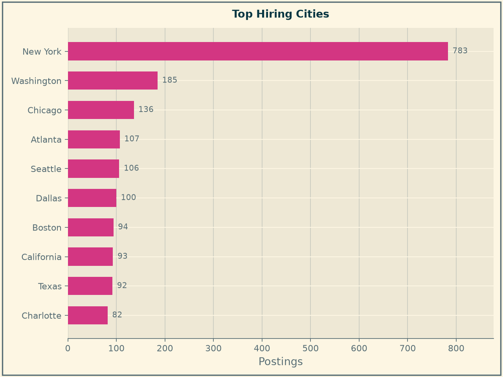
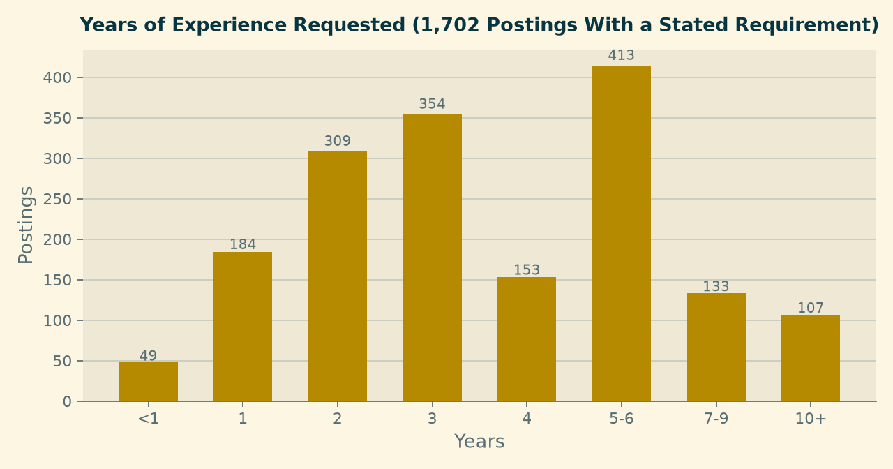
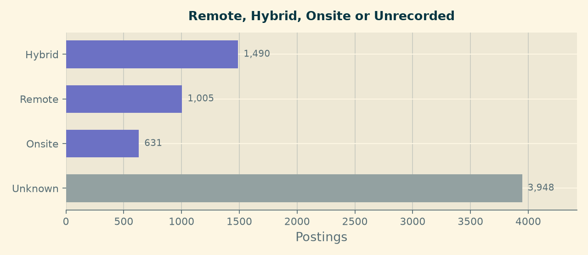
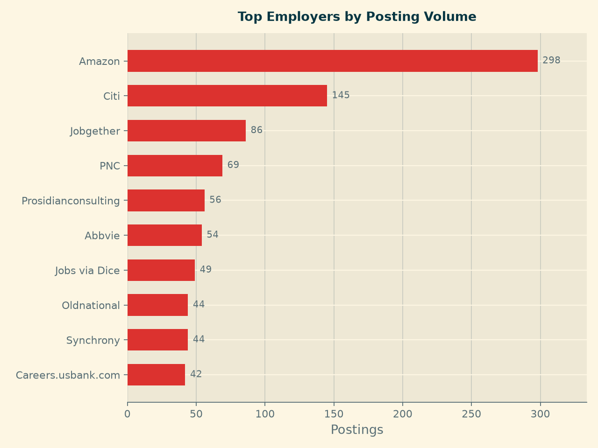

## Purpose

This is the current state of the market the product advises on: **7,074 postings** for Business Intelligence and Data Analyst roles in NAICS 523, Securities, Commodity Contracts and Other Financial Investments, published on or after 1 September 2025.

Every figure below is drawn from `data/processed/career_market_panel.csv`. How that table was built, and where its gaps are, is documented on the [Data Preparation](data_cleaning.qmd) page. Coverage varies sharply by field, so each chart states how many postings it is based on. Where a field proved unusable, it is indicated rather than reporting a number that is not supported.

## What The Occupation Codes Do— And Do Not— Tell Us 

Read this chart as a finding about the data, not about the market.

An occupational code is present on only **2,357 of 7,074 postings, 33 percent**. Within that labeled third, Management Analysts account for 1,991 postings. But the coding itself does not survive inspection. Postings titled "Senior Financial Analyst, AWS GTM Finance" and "Sr Financial Analyst, Inbound Finance Insights" are coded as **Models, Demonstrators, and Product Promoters** — the third-largest occupation on the chart. On **2,165 postings the provider also overwrote the job title with the occupation name**, so the title field on those rows describes a classification rather than a vacancy.

This is reported instead of being deleted because it justifies a design decision that runs through the whole project. The team's role filter combines occupational codes with title keywords rather than trusting either alone, and this chart is the evidence for why. It is also a caution for anyone building on the same source: a market study that filtered on SOC codes here would silently describe the wrong population.

The practical consequence for a job seeker is narrower but real. Occupational classification in this industry is unreliable enough that filtering job boards by occupation category will both miss relevant roles and surface irrelevant ones.

## How Titles Are Written

Rebuilt from the raw posting titles, the panel contains **4,000 distinct titles across 7,074 postings**. The most common single title, "senior financial analyst", appears **122 times — 1.7 percent of the panel**.

The three most frequent titles together account for just 261 postings, **under 4 percent of the market**.

Titles here are effectively unique strings. The practical consequence for a candidate is that title-based job alerts are close to useless in this industry: a saved search for "Data Analyst" will miss over ninety percent of the relevant openings. Searching by skills and by employer returns far more of the real market.

## What The Work Pays

Among the **1,741 postings (25 percent) that disclose pay**, the median annual midpoint is **\$112,500**, with the middle half falling between \$87,500 and \$141,500.

Postings that quote pay hourly or monthly are validated on their own scale rather than deleted as implausible, but they are not converted to annual figures, because the conversion requires an assumption about hours worked that the postings do not supply. This chart therefore covers the postings quoting annual pay.

Two cautions belong with the number. First, three postings in four say nothing about pay, and employers who publish ranges are not a random sample — pay-transparency laws apply in some states and not others, so the disclosed group skews toward those jurisdictions and toward larger employers. Second, this is the midpoint of a posted range, not an offer. Read it as an orientation for expectations, not a benchmark to negotiate against.

## Where The Jobs Are

A usable state is recorded on **5,135 postings, 73 percent of the panel**. New York leads with 726, followed by California (606), Texas (437), Florida (286) and Illinois (260).

That 73 percent is itself the product of cleaning. The raw field mixed full state names with two-letter codes, so New York appeared twice, and it also contained 1,202 postings labelled simply "United States" and 178 labelled "Remote" — a country and a work arrangement, neither of which is a place. Those were removed rather than counted.

At city level New York is the clear center with 783 postings, ahead of Washington (185), Chicago (136), Atlanta (107) and Seattle (106).

Securities and investments remains a concentrated industry geographically. New York alone holds more postings than the next four cities combined, which is a meaningful constraint for a candidate unwilling to relocate — and a meaningful argument for weighting remote-friendly employers.

## How Much Experience Is Asked For

A stated experience requirement survives on **1,702 postings, 24 percent of the panel**. Among those, the median is **three years** and the middle half falls between two and five.

The coverage here is low for a reason worth recording. The raw field reported a requirement of zero years on 2,288 postings, but on 2,143 of them the stated maximum was exactly one year — a fixed "0 to 1" band attached to postings titled Senior Financial Analyst, Finance Manager and Accounting Manager. That is a provider default, not a market signal, and leaving it in produced a median of zero years. To prevent this, the placeholder band was removed and instead the smaller, reliable subset was reported.

On that subset, the market reads as mid-career but not closed: **only 49 postings ask for less than a year**, while 413 ask for five to six and 107 ask for ten or more. A student targeting this industry directly out of a program is competing for a narrow band of openings. The realistic paths are the small entry segment, adjacent industries with more junior demand, or roles where demonstrable skills substitute for years served. The [Skill Gap Analysis](skill_gap_analysis.qmd) page tests which skills most effectively close that distance.

## Remote, Hybrid Or Onsite

A work arrangement is recorded on **3,126 postings, 44 percent of the panel**. Among those, **hybrid leads at 48 percent, fully remote at 32 percent and onsite at 20 percent**.

This contradicts the expectation was set out in the [Project Overview](introduction.qmd), where it was predicted that remote openings in finance would be rarer than in the software sector. On the labeled subset, four in five analytics postings in this industry offer some flexibility. The contradiction is reported rather than an adjustment to the hypothesis after the fact.

The caveat is the unlabelled majority. "Unknown" is shown as its own bar and never folded into "onsite", because an unlabelled posting is an absence of information, not evidence of an office requirement.

## Who Is Hiring

Before this section can say anything, the employer field needs cleaning. On **397 postings (6 percent)** it holds an applicant-tracking hostname such as `Eofe.fa.us2.oraclecloud.com` instead of a company name, and on a further **229 (3 percent)** it names a staffing agency or job aggregator rather than the firm doing the hiring. Three spellings of JPMorgan Chase were also being counted as three separate employers. All of these are flagged and set aside, which leaves **6,448 postings, 91 percent of the panel, with an identifiable employer**.

On that subset the market is **highly fragmented: 2,348 distinct employers**. The largest, Amazon, accounts for 298 postings — **4.6 percent** — followed by Citi at 2.2 percent, then U.S. Bank and JPMorgan Chase at 1.3 percent each. The top ten employers together hold 14 percent.

The strategic read is that there is no short list of firms to focus a search on. Breadth matters more than targeting here. Amazon's position at the top is also a reminder that industry assignment follows the employer record rather than the specific business unit, so some postings sit in NAICS 523 for reasons that are not obvious from the company name.

## What This Means For The Product

Five things a candidate should take from this baseline:

1. **Search by skills and employers, not by title or occupation.** There are 4,000 distinct titles, the most common covers under two percent of the market, and the occupational codes are demonstrably wrong on a large share of postings.
2. **Expect a mid-career market.** Where a requirement is stated, the median is three years and fewer than one posting in thirty asks for less than a year.
3. **Flexibility is available.** Four in five labeled postings are remote or hybrid, which widens the geographic options considerably.
4. **New York dominates, but not exclusively.** It holds more postings than the next four cities combined; remote-friendly employers are the counterweight.
5. **Treat salary figures as orientation.** They come from the one posting in four that discloses pay.

The [Skill Gap Analysis](skill_gap_analysis.qmd) page turns these observations into a personal assessment: which skills separate the postings a given candidate can win from the ones they cannot, and what to learn first.

---

*Figures and chart design by Katie Bowles. Field normalization and the Module 3 data-quality review by Fuad Babaiev.*
