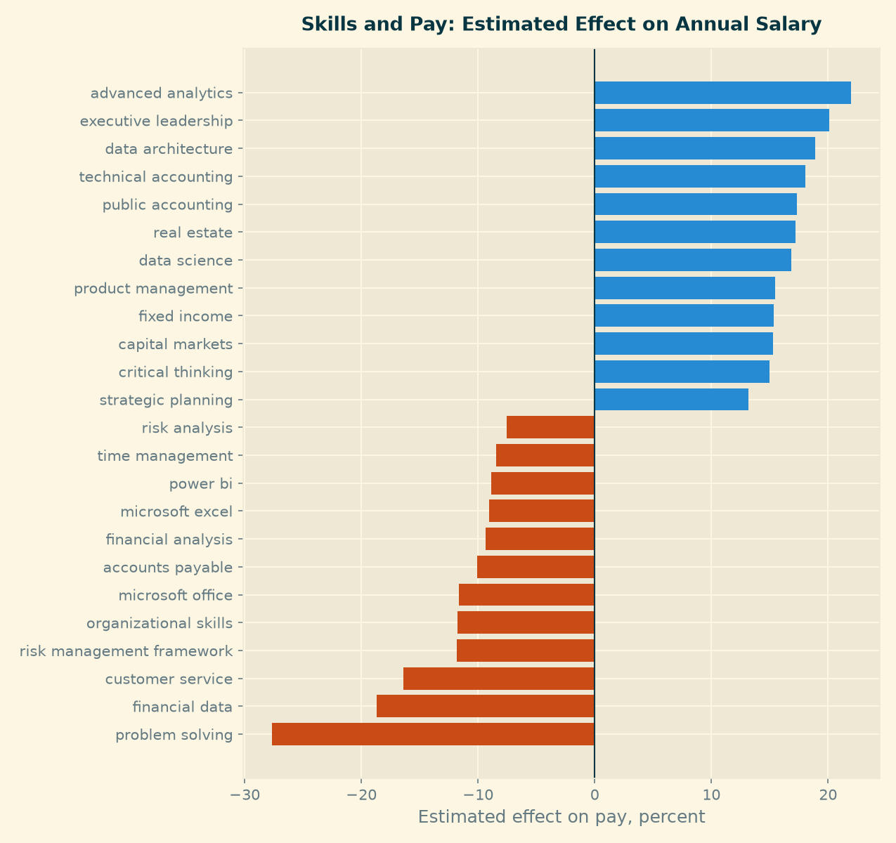
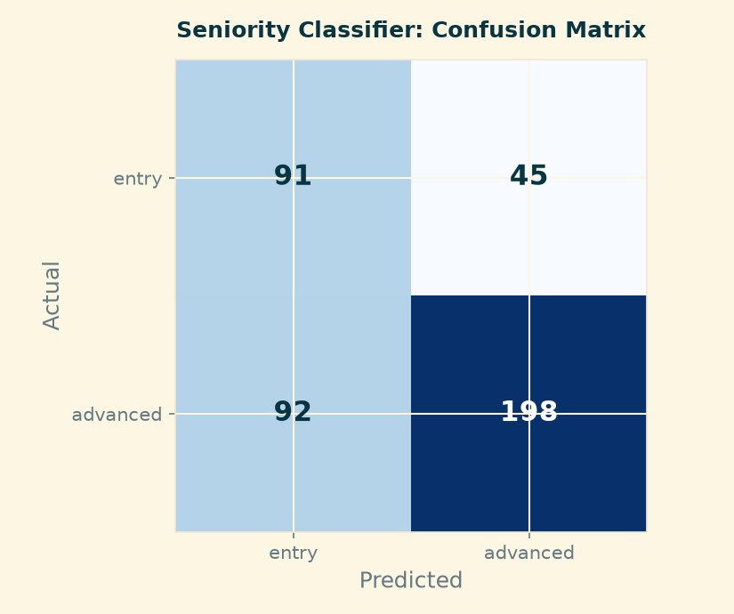
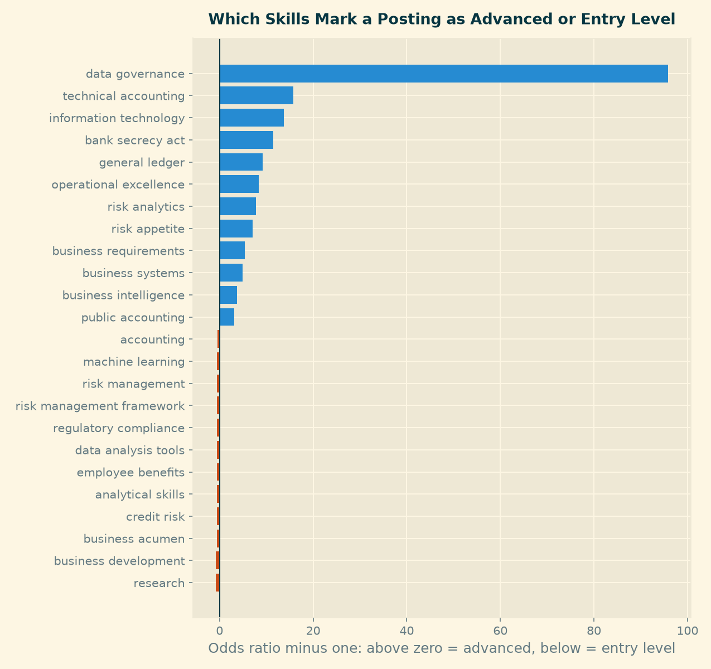

## Purpose

The earlier pages describe what the market looks like. This page asks a narrower question, the one Module 5 was built around: **which skills most strongly distinguish stronger opportunities from weaker ones?**

"Stronger" is defined two ways, because a job seeker cares about two different things. A stronger posting pays more, and a stronger posting is one they can realistically get. Each definition gets its own model.

Both models read the same input: a binary indicator for each of the **179 skills that appear in at least one percent of the panel**, built once in `notebooks/30_build_features.py`. Postings list a median of ten skills each, drawn from 3,327 distinct names.

::: {.callout-note}
The skill field is stored as a JSON list, not as delimited text. Splitting it on a separator silently collapses an entire posting into a single skill, which produces plausible-looking but meaningless counts. The feature builder parses it.
:::

---

## Track 1 — Regression: What Skills Are Worth

### What was modeled

The natural logarithm of the annual salary midpoint, predicted from the skills a posting lists. Pay is heavily right-skewed in this panel, from \$25,000 to \$696,000 against a median of \$112,500, so a model on the raw figure would chase a handful of very large ranges. Working in logs also makes each coefficient readable as an approximate percentage effect on pay.

Two specifications were fitted. The first uses skills alone. The second adds the ten largest states and the work arrangement as controls, so that the skill effects can be separated from the simple fact that some cities pay more.

### Why it matters for a job seeker

A candidate choosing what to learn next is making an investment decision. Knowing which skills sit in better-paid postings turns that choice from guesswork into something measurable.

### What variables were used

179 binary skill indicators, plus 13 geography and work-arrangement controls in the second specification. Fitted on the **1,741 postings (25 percent of the panel) that disclose pay**, with ridge regularisation and the penalty chosen by cross-validation.

### How performance was evaluated

A quarter of the postings were held out and never used in fitting. Results are reported on that held-out set and confirmed with five-fold cross-validation.

| Model | Held-out R² | Cross-validated R² | RMSE | MAE |
|---|---|---|---|---|
| Predict the median for everyone | −0.014 | — | \$51,224 | \$36,576 |
| Skills only | 0.366 | 0.299 (sd 0.034) | \$40,930 | \$28,751 |
| **Skills + geography and remote status** | **0.373** | **0.319** (sd 0.036) | **\$40,821** | **\$28,552** |

Two things stand out. The skill mix explains roughly a third of the variation in pay, which is substantial for a model that reads nothing but a list of keywords. And **adding geography barely moves the result** — 0.366 to 0.373. In this industry, what the job asks for matters more than where it is.

### What the result means in practical career terms

Coefficients are reported only for the 107 skills appearing in at least 30 of the salaried postings; 72 rarer skills were estimated but are not shown, because a coefficient fitted on a handful of rows is noise rather than a finding.

**Skills associated with higher pay:** advanced analytics (+22%), executive leadership (+20%), data architecture (+19%), technical accounting (+18%), public accounting (+17%), data science (+17%), fixed income (+15%), capital markets (+15%).

**Skills associated with lower pay:** problem solving (−28%), financial data (−19%), customer service (−16%), organizational skills (−12%), Microsoft Office (−12%), financial analysis (−9%), Microsoft Excel (−9%), Power BI (−9%).

The pattern is not "technical versus non-technical". It is **specific versus generic**. Compare the pairs: "financial analysis" costs 9 percent, while "fixed income" and "capital markets" each add 15. "Problem solving" costs 28 percent, while "data architecture" adds 19. The same holds for tools — Microsoft Excel appears in 779 of the salaried postings and is associated with lower pay, while Power BI, a real BI tool, carries no premium either.

A direct comparison of the top and bottom salary quartiles makes the division concrete:

| Skill | Top quartile (≥ \$141,500) | Bottom quartile (≤ \$87,500) |
|---|---|---|
| Python | 33.0% | 9.8% |
| SQL | 35.0% | 19.2% |
| Data science | 12.6% | 0.0% |
| Machine learning | 7.6% | 0.0% |
| Microsoft Excel | 25.6% | 51.8% |
| Microsoft Office | 5.0% | 27.5% |

Data science and machine learning appear in **no bottom-quartile posting at all**. Excel appears in over half of them.

The honest limit: two thirds of the variation in pay remains unexplained, and the average error is still \$28,500. This model narrows a guess; it does not price a job.

---

## Track 2 — Classification: Which Postings Are Reachable

### What was modeled

Whether a posting is entry level or advanced, predicted from its skills. Postings stating a requirement of two years or less are labelled entry level; the rest are advanced. The split is **542 entry against 1,160 advanced**, so the classes are imbalanced and the model was fitted with balanced class weights.

### Why it matters for a job seeker

The [Market Baseline](eda.qmd) established that this is a mid-career market: where a requirement is stated at all, the median is three years. A student leaving a programme is competing for the smaller share. A model that can read seniority from the skill list lets them filter a job board down to the postings actually worth an application.

### What variables were used

The same 179 skill indicators, fitted on the **1,702 postings (24 percent) that state an experience requirement**, with logistic regression and the penalty chosen by cross-validation.

### How performance was evaluated

The same held-out quarter, judged on precision and recall for each class rather than on accuracy alone.

| Metric | Model | Majority-class baseline |
|---|---|---|
| Accuracy | 0.678 | **0.681** |
| ROC AUC | 0.741 | 0.500 |
| Entry: precision / recall / F1 | 0.50 / **0.67** / 0.57 | — / **0.00** / — |
| Advanced: precision / recall / F1 | 0.81 / 0.68 / 0.74 | 0.68 / 1.00 / 0.81 |

**The model does not beat the baseline on accuracy, and we report that plainly.** It is marginally worse, 0.678 against 0.681. But accuracy is the wrong measure here. The baseline reaches 68 percent by calling every posting advanced, which means it identifies **zero** of the openings a student could apply to. The model finds 91 of 136. For a product whose job is to say "apply here", that difference is the entire value, and an AUC of 0.741 confirms the signal is real rather than noise.

The cost is visible in the matrix: 45 entry-level postings were missed, and 92 advanced postings were wrongly flagged as reachable. A candidate using this filter will waste some applications. That is the better error to make — a wasted application costs an hour, a missed opening costs the job.

### What the result means in practical career terms

Two skills separate completely — every posting listing **data architecture** (52 postings, 100 percent advanced) and **treasury management** (57 postings, 98 percent) falls on the senior side. For these the direction is certain but the magnitude is an artifact, so only the direction is reported.

Among the rest, the **markers of a senior posting are consistently specific**: data governance (97 percent advanced), information technology (97 percent), bank secrecy act (98 percent), technical accounting (88 percent), general ledger (85 percent), risk analytics (83 percent).

The entry-level signal is much weaker, and this is itself a finding. Against a base rate of 68 percent advanced, only a few skills sit meaningfully below it: research (28 percent advanced), employee benefits (44 percent), business development (47 percent), data analysis tools (50 percent). Most of the remaining "entry markers" sit within a few points of the base rate. **Postings announce seniority clearly; they do not announce accessibility.**

::: {.callout-warning}
## A caution on reading coefficients

A logistic coefficient is conditional on every other skill in the posting; the raw share of advanced postings is not. For 21 of the 107 skills the two disagree — "sales" carries the strongest entry-level coefficient in the model, yet 69 percent of postings listing it are advanced, slightly above the base rate. Where the two measures conflict, the effect is a product of correlation between skills and is not reported here as a property of the skill. Only skills where both point the same way appear in the lists above.
:::

---

## What The Two Models Say Together

They agree, and the agreement is the finding.

**Specificity is what the market pays for and promotes on.** Across both models the same division appears: named capabilities — data architecture, data governance, technical accounting, fixed income, capital markets, bank secrecy act — sit in the well-paid and senior postings. Generic descriptors — problem solving, analytical skills, organizational skills, business acumen — sit in the cheap and junior ones. A candidate writing a CV should take this literally: "experienced with financial analysis" is the phrasing of a \$90,000 posting, "fixed income attribution" is the phrasing of a \$140,000 one.

**There is one skill set that pays well without demanding years.** Machine learning appears in 7.6 percent of top-quartile postings and in none of the bottom quartile, yet on the seniority split it sits at the base rate — 67 percent advanced against 68 percent overall. The same broadly holds for data science. For a student leaving a programme, that combination is the clearest point of leverage in this data: a skill that raises the pay a posting offers without raising the experience it demands.

**Excel is the floor, not the ladder.** It appears in 779 of the 1,741 salaried postings, more than any other skill, and is associated with lower pay in the model and with the bottom quartile in the raw comparison. It is necessary and it is not an advantage.

These three findings feed the [Career Strategy](career_plan.qmd) page, where they become specific actions.

---

## Limitations

**Both models describe disclosed subsets.** Pay is stated on 25 percent of the panel and experience on 24 percent, and neither group is a random sample — pay-transparency law varies by state, and employers who state requirements may differ systematically from those who do not. Every number here describes the postings that told us, not the market.

**Association is not causation.** Listing Python does not cause a posting to pay more. Python marks a different kind of role, and the role carries the pay. The practical reading is about which postings to target, not about what adding a line to a CV will do on its own.

**The feature set is deliberately narrow.** Only skills are used, because the question was about skills. Employer, title seniority and city are not in the model, which is why the regression leaves two thirds of the variation unexplained.

**Skill names are the provider's.** They are normalised for case and bracketed qualifiers but not for synonyms, so closely related names are counted separately.

## Reproducing This Step

1. `python notebooks/30_build_features.py` — parse skills, build the feature matrix
2. `python notebooks/31_regression_salary.py` — regression on compensation
3. `python notebooks/32_classify_seniority.py` — classification of seniority

Full numeric output is written to `outputs/m5_regression_log.md` and `outputs/m5_classification_log.md`.
